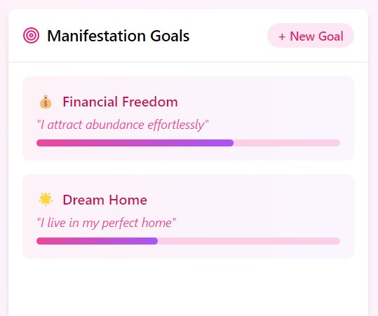
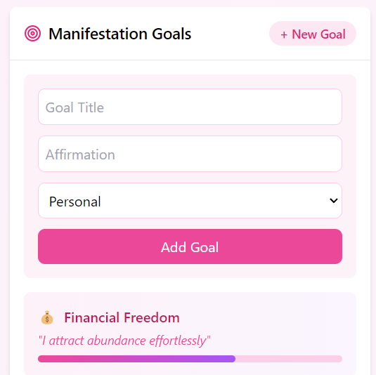
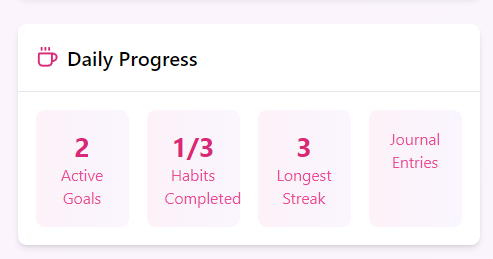
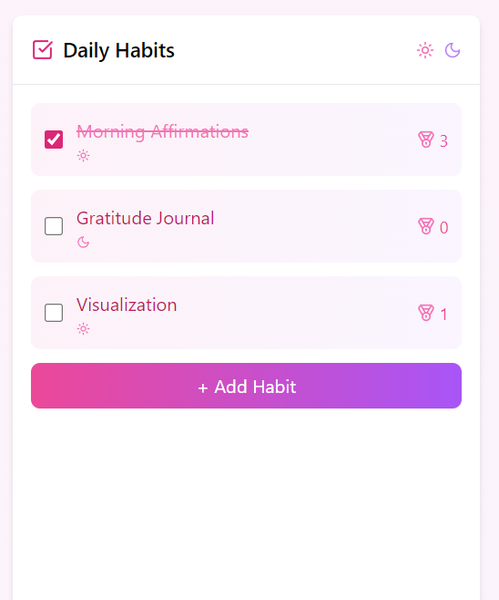

# Dreamify  (Python/Flask with React)

The Manifestation Dashboard is a dynamic personal development tool that combines goal tracking, daily habits, and journaling. It helps users manifest their dreams into reality by providing an organized space to track goals and document their journey through an AI-enhanced journaling system


---
## Try the app

[Dreamify/Manifestation dashboard](https://dreamify-two.vercel.app/)

[Backend](https://github.com/sneha-4-22/backend)
## Screenshots

## Dreamify - Manifestation Board Features

### Vision Board

|                                      |                              |
| ------------------------------------------------------------------------- | ------------------------------------------------------------- | 
| **Visualize Your Dreams:**                                                | **Inspiration for Growth:**                                   | 
| Here paste the image addresses from Pinterest that align with your goal   | Add images that inspire you and represent your aspirations.   |


### Dream Journal

|                       |                     |
| -----------------------------------------------  | ---------------------------------------------------- | 
| **Document Your Journey:**                       | **Reflect on Your Growth:**                          | 
| Write your dreams, goals, and experiences        | Review your progress and achievements                |

### Manifestation Goals

|                          |                            |
| ----------------------------------------------- | ---------------------------------------------------- | 
| **Goals Overview**                              | **Edit Your Goals**                                  | 
| Easily track your goals and stay focused on your aspirations. | Click the "+ New Goal" icon, enter your affirmation title, and select a category to customize your goals. |

### Daily Progress & Habits


|              |                       |
| ----------------------------------------------- | ---------------------------------------------------- | 
| **Track Your Daily Progress**                   | **Monitor Your Daily Habits**                        | 
| Stay on top of your goals by tracking your daily achievements. | Record your daily habits to maintain consistency and progress. |


## ✨ Features  


### 1. **AI Journal Insights**
   - **Mood Selection**: A set of mood emojis (✨, 🌟, 💫, 🦋, 🌈, 💖, 🙏, 💭) to express the user's current mood.
   - **AI Insights Generation**: After writing a journal entry, users can get AI-generated insights by clicking the *Get AI Insights* button. This is powered by a backend API.
   - **Journal Entry Saving**: Users can save their journal entry, along with AI insights and mood, which will be displayed in a list of past entries.
   - **Error Handling**: If no journal entry is provided or AI insights generation fails, an error message is displayed.
   - **Visualization of Past Entries**: A list of previously saved journal entries with their AI insights, moods, and dates.


### 2. **Goals Tracker**
   - Set and track manifestation goals with progress bars.
   - Add new goals and affirmations, categorized for easy organization.

### 3. **Habit Tracker**
   - Keep track of daily habits like affirmations or gratitude.
   - Celebrate streaks and progress with fun visuals.

### 4. **Vision Board**
   - Upload your dreams with images to create your personal vision board.


---

## 🛠 Prerequisites  

Make sure you have the following installed before using this project:  

- [Render]()  
- [Daytona](https://www.daytona.io/docs/installation/installation/)  

---

## 📂 Repository Structure  

```plaintext  
├── src/  
│   ├── app.js                  # Flask application  
│   ├── components/             # React components directory  
│   │   ├── app.py             # Main React app file  
│   │   ├── ManifestationDashboard.js  # Component for the Manifestation Dashboard  
│   │   ├── Card.js             # Reusable card component  
│   └── requirements.txt        # Python dependencies  
├── .devcontainer/  
│   └── devcontainer.json       # Daytona configuration  
└── README.md                   # Project documentation  

```  

---
## 🚀 Getting Started  

### Open Using Daytona  

1. **Install Daytona**: Follow the [Daytona installation guide](https://www.daytona.io/docs/installation/installation/).  

2. **Create the Workspace**:  
   ```bash  
   daytona create <DREAMIFY_REPO_URL> 
   ```  

3. **Build the Environment**:  
   Daytona automatically sets up all dependencies using devcontainers.  

4. **Start the Application**:  

   - For the backend (Python/Flask):  
     ```bash  
     python app.py  
     ```  
   - For the frontend (React):  
     ```bash  
     npm start  
     ```  

5. **Access the App**:  
   Open your browser and navigate to:  
   ```
   http://localhost:5000
   ```
   ```
   or just visit the link in my discription i have deployed the backend too using render it will work with ai insights also
   ```

---

## 🤝 Contributing  

Contributions are welcome! Please submit a pull request or open an issue for any ideas or improvements.

---

## 📜 License  

This project is licensed under the MIT License.  


