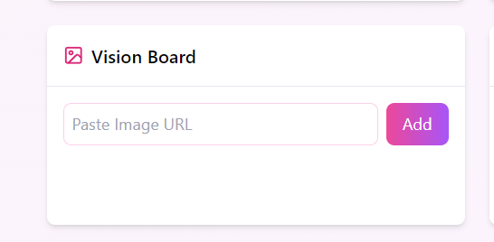
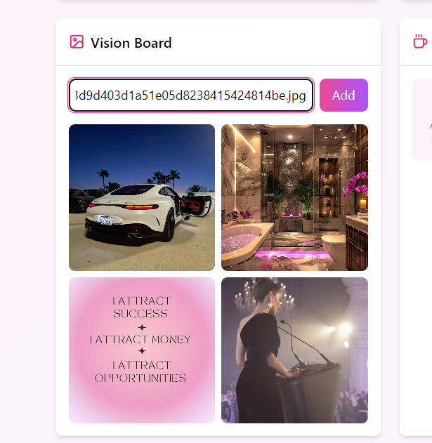
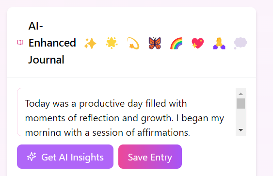
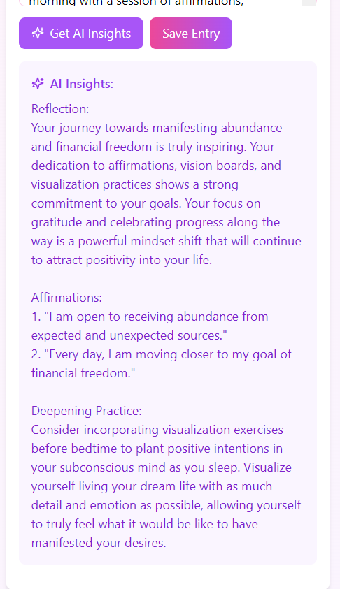

# Dreamify  (Python/Flask with React)

Dreamify is an AI-powered application that provides personalized dream interpretations and manifestation insights. It combines NLP-driven dream analysis with a beautifully designed manifestation dashboard, making it an intuitive and inspiring platform for users.

This repository demonstrates how to integrate **Daytona** into Dreamify, offering a standardized, reproducible development environment.

---
## Screenshots

## Dreamify - Manifestation Board Features
<!--
### Vision Board

|             |               |
| ----------------------------------------------- | ----------------------------------------------- | 
| **Visualize Your Dreams:**                      | **Inspiration for Growth:**                     | 
| Create a visual representation of your goals    | See images that inspire your manifestation      |
-->
### Vision Board

|            |                                     |
| ----------------------------------------------- | -------------------------------------------------------------------- | 
| **Visualize Your Dreams:**                      | **Inspiration for Growth:**                                          | 
| Create a visual representation of your goals    |  Here add paste the img addresses from pinterest that align your goal|
<!--
### Gratitude Board

|      |          |
| ----------------------------------------------- | ---------------------------------------------------- | 
| **Daily Gratitude Practice:**                   | **Thankful for Moments:**                           | 
| Keep track of things you are grateful for       | Reflect on small victories and thankful moments       |
-->
### Dream Journal

|                       |                     |
| -----------------------------------------------  | ---------------------------------------------------- | 
| **Document Your Journey:**                       | **Reflect on Your Growth:**                          | 
| Write your dreams, goals, and experiences        | Review your progress and achievements                |


## 🚀 Getting Started  

### Open Using Daytona  

1. **Install Daytona**: Follow the [Daytona installation guide](https://www.daytona.io/docs/installation/installation/).  

2. **Create the Workspace**:  
   ```bash  
   daytona create <DREAMIFY_REPO_URL> 
   ```  

3. **Build the Environment**:  
   Daytona automatically sets up all dependencies using devcontainers.  

4. **Start the Application**:  

   - For the backend (Python/Flask):  
     ```bash  
     flask run  
     ```  
   - For the frontend (React):  
     ```bash  
     npm start  
     ```  

5. **Access the App**:  
   Open your browser and navigate to:  
   ```
   http://localhost:5000
   ```  

---

## ✨ Features  


### 1. **AI Journal Insights**
   - **Mood Selection**: A set of mood emojis (✨, 🌟, 💫, 🦋, 🌈, 💖, 🙏, 💭) to express the user's current mood.
   - **AI Insights Generation**: After writing a journal entry, users can get AI-generated insights by clicking the *Get AI Insights* button. This is powered by a backend API.
   - **Journal Entry Saving**: Users can save their journal entry, along with AI insights and mood, which will be displayed in a list of past entries.
   - **Error Handling**: If no journal entry is provided or AI insights generation fails, an error message is displayed.
   - **Visualization of Past Entries**: A list of previously saved journal entries with their AI insights, moods, and dates.


### 2. **Goals Tracker**
   - Set and track manifestation goals with progress bars.
   - Add new goals and affirmations, categorized for easy organization.

### 3. **Habit Tracker**
   - Keep track of daily habits like affirmations or gratitude.
   - Celebrate streaks and progress with fun visuals.

### 4. **Vision Board**
   - Upload your dreams with images to create your personal vision board.

### 5. **Charming UI**
   - Clean, modern, and responsive design with soft pastel gradients.
   - Smooth animations and cozy interactions.

### 6. **Backend Integration**
   - AI-driven insights and goal tracking backed by a smooth backend.
---

## 🛠 Prerequisites  

Make sure you have the following installed before using this project:  

- [Docker](https://www.docker.com/)  
- [Daytona](https://www.daytona.io/docs/installation/installation/)  

---

## 📂 Repository Structure  

```plaintext  
├── src/  
│   ├── app.js                  # Flask application  
│   ├── components/             # React components directory  
│   │   ├── app.py             # Main React app file  
│   │   ├── ManifestationDashboard.js  # Component for the Manifestation Dashboard  
│   │   ├── Card.js             # Reusable card component  
│   └── requirements.txt        # Python dependencies  
├── .devcontainer/  
│   └── devcontainer.json       # Daytona configuration  
└── README.md                   # Project documentation  

```  

---

## 🤝 Contributing  

Contributions are welcome! Please submit a pull request or open an issue for any ideas or improvements.

---

## 📜 License  

This project is licensed under the MIT License.  


### Updates Based on Your Input:
1. **Features Section**: Included specific features like the Manifestation Dashboard, Dream Analysis, Mood Tracking, Gamification, and Social Integration.
2. **Description**: Highlighted the project’s goal of empowering users with dream interpretations and manifestation insights.
3. **Getting Started**: Adjusted instructions to keep it aligned with Daytona integration while ensuring the project’s use case is clear.


